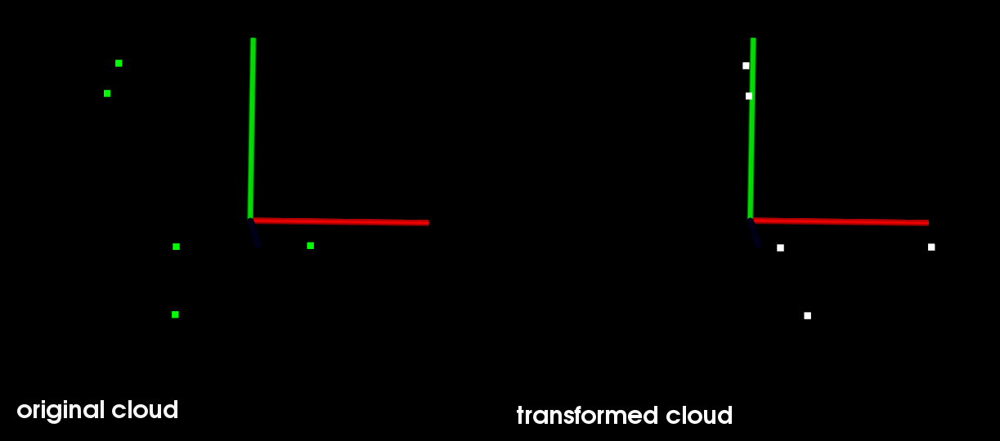

# 点群マッチングアルゴリズム

## Compile & Execute

```bash
mkdir build
cd build
cmake ..
make

../icp
../svd_scale
```

## ICP

簡単なフローは  
1. ５個の点をランダムに作成しinputとする
2. inputからx方向に0.7ずらしたものをoutputとする
3. icp関数に入れ，結果を表示

